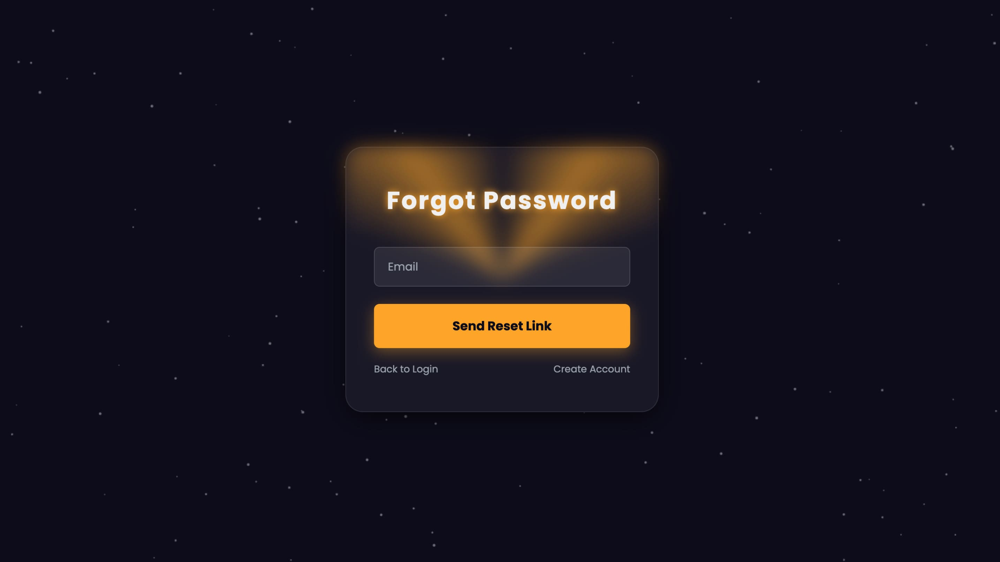

# 🔑 Auth Portal Responsive

A fully responsive **Authentication Portal** that includes:  
- **Login Page** 🔒  
- **Register Page** 📝  
- **Forgot Password Page** 🔑  

Designed with **HTML**, **CSS**, and **JavaScript** to ensure a **smooth, modern, and mobile-friendly experience**.  
👉 **Live Demo:** https://amarire.dev/demo/portals-demo/auth-portal/login.html
---

## 📸 Screenshots

| Login | Register | Forgot Password |
| --- | --- | --- |
|  |  |  |

---

## 📂 Project Structure

─ login.html

- register.html
  
─ forgot-password.html

─ css/

   ─ style.css
   
─ js/

   ─ script.js

---

## ✨ Features

- ✅ **Responsive design** for mobile, tablet, and desktop  
- 🔒 **Login** with styled, animated form  
- 📝 **Register** with full name, username, email, password + confirm password  
- 🔑 **Forgot Password** with reset flow (frontend)  
- 👀 **Password toggle** (show/hide with eye icons)  
- 🧠 **Client-side validation** (e.g., password match & basic checks)  
- 🎨 **Modern UI** (frosted glass, amber glow, smooth animations)  
- ⚡ **Lightweight & fast** (pure HTML/CSS/JS, no frameworks)  

---

## 🚀 How to Use

1) **Clone the repository**  

2. Navigate to the project folder
cd auth-portal-responsive

3. Open any HTML file in your browser

- login.html
- register.html
- forgot-password.html

**You can also use a simple local server:**

python -m http.server 8080

Then open http://localhost:8080
 in your browser

📱 Responsive Design

This project adapts seamlessly to different screen sizes:

📲 Mobile

💻 Tablet

🖥️ Desktop

Resize your browser or test on real devices to experience the layout and animations.

🛠️ Built With

HTML5 – semantic structure

CSS3 – modern styling & animations

JavaScript (ES6) – interactivity, validation, and background effects

🧩 Customization

🎨 Colors & theme: tweak CSS variables in :root (e.g., --amber-glow, --bg-color)

⚙️ Validation rules: adjust checks in js/script.js (or per-page JS files)

🧱 Fields & layout: edit the forms in the respective HTML files

🌐 Routing/Integration: wire up API endpoints in JS when back-end is ready

📌 Roadmap / Future Improvements

🌐 Multi-language support (i18n)

🔑 Back-end integration (PHP / Node.js / Django / Laravel)

🔗 Social logins (Google, GitHub, etc.)

🧾 Form-level error summaries & inline hints

🎉 Enhanced micro-animations & accessibility improvements (a11y)

🤝 Contributing

Contributions, issues, and feature requests are welcome!
Open an issue or pull request here: https://github.com/Said-Amarire/auth-portal-responsive/issues

📜 License

Released under the MIT License.
You’re free to use, modify, and distribute this project with attribution.

👨‍💻 Author

Amarire Dev
Website: https://amarire.dev

GitHub: https://github.com/Said-Amarire
